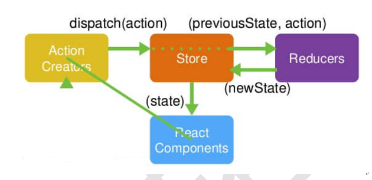

### redux-demo
#### Concept
1. Store(必须唯一)
2. Reducer(**reducer接受state但千万不要改变state,通过拷贝完成**,必须是纯函数)
1. Action
2. React component

#### Redux DevTools

#### 企业实际开发
1. 抽取`actionTypes.js`
2. 抽取`actionCreator.js`

#### 坑
1. `store`必须唯一
2. `reducer`必须纯函数
3. 只有`store`能改变`state`内容,`reducer`不能改变

#### 无状态组建